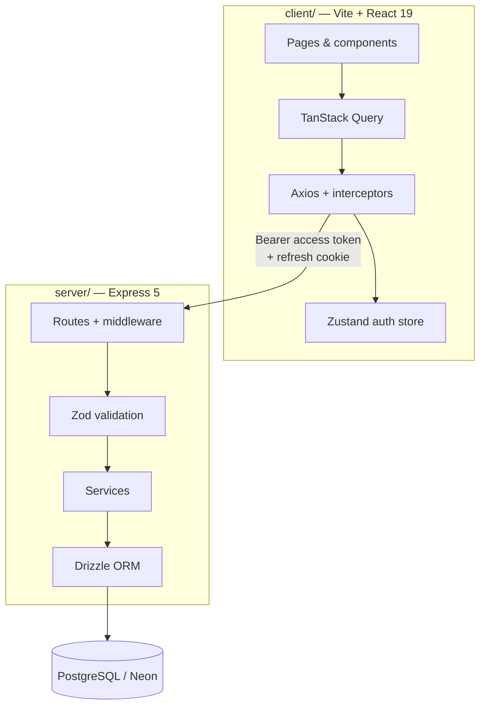

<div align="center">

# ProjectHub

**One workspace for people, students, tasks, and notes — secured by role-aware access.**

A full-stack management app with JWT authentication, refresh-token rotation, and a React dashboard tuned to how each role actually works.

<br />

[](https://react.dev/)
[](https://www.typescriptlang.org/)
[](https://expressjs.com/)
[](https://neon.tech/)
[](https://orm.drizzle.team/)

</div>

---

## Table of contents

- [Overview](#overview)
- [Features](#features)
- [Role-based access](#role-based-access)
- [Architecture](#architecture)
- [Tech stack](#tech-stack)
- [Project structure](#project-structure)
- [Getting started](#getting-started)
- [Environment variables](#environment-variables)
- [API reference](#api-reference)
- [Database & migrations](#database--migrations)
- [Scripts](#scripts)
- [Author](#author)

---

## Overview

**ProjectHub** is a monorepo-style application split into a **Vite + React** client and an **Express + Drizzle** API. Users sign in once and land on a dashboard whose shortcuts match their role: admins manage the full user directory, teachers maintain student records, and everyone can organize **tasks** and personal **notes** within the permissions they’re granted.

The API is validated with **Zod**, passwords are hashed with **Argon2**, and sessions use a **short-lived access token** (Bearer header) plus an **httpOnly refresh cookie** that the client renews automatically when access expires.

---

## Features

| Area | What you get |
|------|----------------|
| **Authentication** | Register, login, logout, `/me` profile, silent token refresh via cookie |
| **Users** | Paginated admin table — create, update (field-level rules), soft-delete |
| **Students** | Enroll and manage student records (Admin & Teacher) |
| **Tasks** | Title, description, status, priority, due date, assignee; admins see all, others see created/assigned |
| **Notes** | Rich-text body (Quill), search, sort, pagination; strict per-user ownership |
| **Dashboard** | Role-filtered quick-access cards to the modules you can use |
| **Profile** | View and edit your account from the shell layout |
| **UX** | shadcn/ui primitives, Tailwind v4, toasts, loading/empty states, confirm dialogs |

---

## Role-based access

### Frontend routes

| Route | ADMIN | TEACHER | STUDENT | USER |
|-------|:-----:|:-------:|:-------:|:----:|
| `/dashboard` | ✓ | ✓ | ✓ | ✓ |
| `/users` | ✓ | — | — | — |
| `/students` | ✓ | ✓ | — | — |
| `/tasks` | ✓ | ✓ | ✓ | ✓ |
| `/notes` | ✓ | ✓ | ✓ | ✓ |
| `/user/profile` | ✓ | ✓ | ✓ | ✓ |

Public: `/login`, `/register`. All other paths redirect to login.

### API guards (high level)

| Prefix | Auth | Extra |
|--------|------|--------|
| `/api/auth/*` | Mixed | Register/login public; `/me`, `/logout` require Bearer token |
| `/api/users/*` | Bearer | Admin for list/create/delete; granular rules on PATCH |
| `/api/students/*` | Bearer | `ADMIN` or `TEACHER` on router |
| `/api/tasks/*` | Bearer | Scoped listing & edits by role/ownership in services |
| `/api/notes/*` | Bearer | Notes always scoped to the authenticated user |

**Roles:** `ADMIN`, `TEACHER`, `STUDENT`, `USER`  
**Account status:** `ACTIVE`, `INACTIVE`, `BLOCKED`, `DELETED` (non-active accounts cannot authorize)

---

## Architecture



**Auth flow (simplified):** Login returns access token + sets `refreshToken` cookie → client stores token in Zustand → on `401`, client calls `GET /api/auth/refresh` → new access token → queued requests retry.

---

## Tech stack

### Client (`client/`)

- **Runtime:** React 19, React Router 7  
- **Build:** Vite 8, TypeScript  
- **Styling:** Tailwind CSS 4, styled-components (layout accents), Geist variable font  
- **UI:** shadcn/ui, Lucide icons  
- **Data:** TanStack React Query, Axios (`withCredentials`)  
- **Forms & editor:** React Hook Form, react-quill-new  
- **State:** Zustand (auth)

### Server (`server/`)

- **Runtime:** Node.js, Express 5, TypeScript (`tsx` in dev)  
- **Database:** PostgreSQL via `@neondatabase/serverless` / `postgres` driver  
- **ORM:** Drizzle ORM + Drizzle Kit migrations  
- **Security:** Argon2, JWT (access + refresh), httpOnly cookies, CORS tied to `FRONTEND_URL`  
- **Validation:** Zod 4  

---

## Project structure

```
ProjectHub/
├── client/                 # SPA frontend
│   ├── src/
│   │   ├── api/            # Axios instance & refresh queue
│   │   ├── components/     # Layout, Navbar, shared UI
│   │   ├── hooks/          # React Query hooks per domain
│   │   ├── pages/          # Auth, Dashboard, Users, Students, Tasks, Notes, Profile
│   │   ├── routes/         # ProtectedRoute / PublicRoute
│   │   └── store/          # authStore (Zustand)
│   └── vite.config.ts
│
└── server/                 # REST API
    ├── server.ts           # Entry (listen)
    ├── src/
    │   ├── config/         # Typed env
    │   ├── db/             # Drizzle client, schema, migrations
    │   ├── modules/        # auth, users, students, tasks, notes
    │   ├── middlewares/    # auth, validation, errors
    │   ├── services/       # Business logic
    │   └── utils/          # JWT, permissions, validators, responses
    └── drizzle.config.ts
```

---

## Getting started

### Prerequisites

- **Node.js** 20+ (recommended)  
- **PostgreSQL** database (e.g. [Neon](https://neon.tech/) serverless)  
- **npm** for the server; **npm** or **Bun** for the client (repo includes `client/bun.lock`)

### 1. Clone and install

```bash
git clone <your-repo-url> ProjectHub
cd ProjectHub

# API
cd server && npm install

# UI
cd ../client && npm install   # or: bun install
```

### 2. Configure the API

```bash
cd server
cp .env.example .env
```

Edit `.env` with your values (see [Environment variables](#environment-variables)).  
Apply the schema to your database:

```bash
npm run push      # drizzle-kit push (dev/prototyping)
# or
npm run generate  # create migration SQL
# then apply migrations with your preferred workflow
```

### 3. Run the API

```bash
cd server
npm run dev
```

Default: `http://localhost:3000`  
Health check: `GET /health`  
Root: `GET /` returns API module hints.

### 4. Configure and run the client

Optional — defaults to `http://localhost:3000/api` if unset:

```bash
# client/.env.local (create if needed)
VITE_API_URL=http://localhost:3000
```

```bash
cd client
npm run dev       # or: bun run dev
```

Open the URL Vite prints (typically `http://localhost:5173`). Register a user (default role `USER`) or seed an admin in the database for full access.

---

## Environment variables

### Server (`server/.env`)

| Variable | Description |
|----------|-------------|
| `PORT` | HTTP port (e.g. `3000`) |
| `DATABASE_URL` | PostgreSQL connection string |
| `JWT_ACCESS_SECRET` | Secret for access tokens |
| `JWT_ACCESS_EXPIRES_IN` | Access TTL (e.g. `15m`) |
| `JWT_REFRESH_SECRET` | Secret for refresh tokens |
| `JWT_REFRESH_EXPIRES_IN` | Refresh TTL (e.g. `7d`) |
| `FRONTEND_URL` | **Required** — CORS origin for the SPA (e.g. `http://localhost:5173`) |

> **Note:** Copy from `.env.example` and replace placeholders. Do not commit real credentials. Add `FRONTEND_URL` if it is not already in your local `.env`.

### Client (optional)

| Variable | Description |
|----------|-------------|
| `VITE_API_URL` | API origin without `/api` suffix (e.g. `http://localhost:3000`) |

---

## API reference

Base path: **`/api`**. Protected routes expect:

```http
Authorization: Bearer <access_token>
```

Cookie `refreshToken` is required for `GET /api/auth/refresh`.

### Auth — `/api/auth`

| Method | Path | Description |
|--------|------|-------------|
| `POST` | `/register` | Create account |
| `POST` | `/login` | Login; returns user + access token; sets refresh cookie |
| `GET` | `/me` | Current user profile |
| `GET` | `/logout` | Clear refresh token server-side + cookie |
| `GET` | `/refresh` | Issue new access token from refresh cookie |

### Users — `/api/users`

| Method | Path | Notes |
|--------|------|--------|
| `GET` | `/` | Admin — list users (paginated) |
| `GET` | `/:id` | Admin, Teacher |
| `POST` | `/` | Admin — create user |
| `PATCH` | `/:id` | Self or permitted admin/teacher rules |
| `DELETE` | `/:id` | Admin — soft delete |

### Students — `/api/students`

| Method | Path | Notes |
|--------|------|--------|
| `POST` | `/` | Enroll student |
| `GET` | `/` | List (query validation) |
| `GET` | `/:id` | Detail |
| `PUT` | `/:id` | Update |
| `DELETE` | `/:id` | Remove |

### Tasks — `/api/tasks`

| Method | Path | Notes |
|--------|------|--------|
| `POST` | `/` | Create |
| `GET` | `/` | List with pagination/filters |
| `GET` | `/:id` | Detail |
| `PUT` | `/:id` | Update (status transitions enforced in service) |
| `DELETE` | `/:id` | Delete |

### Notes — `/api/notes`

| Method | Path | Notes |
|--------|------|--------|
| `POST` | `/` | Create |
| `GET` | `/` | List own notes (search/pagination) |
| `GET` | `/:id` | Detail (owner only) |
| `PUT` | `/:id` | Update (owner only) |
| `DELETE` | `/:id` | Delete (owner only) |

Responses follow a consistent `{ success, message, data }` shape from the server helpers.

---

## Database & migrations

Schemas live under `server/src/db/schema/`:

- **users** — credentials, role, status, soft delete, hashed refresh token  
- **students** — student ID, contact, enrollment, `addedBy`  
- **tasks** — status (`TODO` \| `IN_PROGRESS` \| `COMPLETED`), priority, assignee, creator  
- **notes** — title, rich-text body, `userId`  

Drizzle Kit:

```bash
cd server
npm run generate   # SQL migrations in src/db/migrations/
npm run push       # push schema to DATABASE_URL
npm run studio     # Drizzle Studio UI
```

---

## Scripts

### Server (`server/`)

| Script | Command |
|--------|---------|
| Dev | `npm run dev` |
| Build | `npm run build` |
| Start (prod) | `npm run start` |
| Typecheck | `npm run typecheck` |

### Client (`client/`)

| Script | Command |
|--------|---------|
| Dev | `npm run dev` |
| Build | `npm run build` |
| Preview | `npm run preview` |
| Lint | `npm run lint` |

---

## Author

**Aman Kumar** — server package metadata (`project-hub-server`).

---

<div align="center">

Built as a practical full-stack reference: typed API, clear module boundaries, and a UI that respects who is signed in.

</div>
